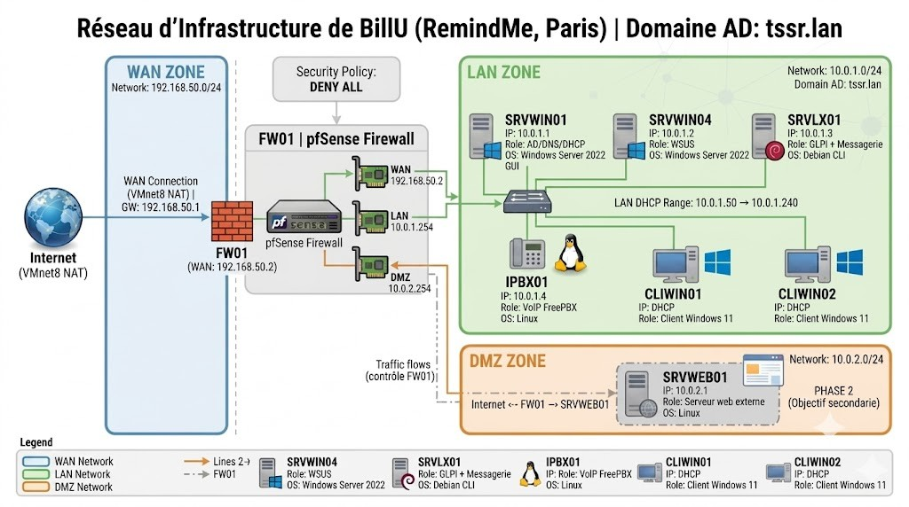

# Architecture — High Level Design (HLD)

## Sommaire

1. [Vue d'ensemble](#1-vue-densemble)
2. [Schéma réseau](#2-schéma-réseau)
3. [Plan d'adressage](#3-plan-dadressage)
4. [Description des zones](#4-description-des-zones)
5. [Flux réseau autorisés](#5-flux-réseau-autorisés)
6. [Pare-feu FW01](#6-pare-feu-fw01)

---

## 1. Vue d'ensemble

L'infrastructure BillU repose sur une architecture **3 zones** séparées par un pare-feu pfSense :

- **WAN** — connexion Internet via VMnet8 (NAT)
- **LAN** — réseau interne hébergeant tous les serveurs et clients
- **DMZ** — zone exposée pour les services accessibles depuis Internet (Phase 2)

Tout le trafic transite obligatoirement par **FW01**, qui applique une politique **Deny All** — seul ce qui est explicitement autorisé passe.

L'environnement est entièrement virtualisé sur **VMware Workstation**, avec le domaine Active Directory **tssr.lan**.

---

## 2. Schéma réseau

---

## 3. Plan d'adressage

### Réseaux

| Zone | Réseau | Passerelle | Usage |
|---|---|---|---|
| WAN | `192.168.50.0/24` | `192.168.50.1` (box FAI) | Accès Internet — VMnet8 NAT |
| LAN | `10.0.1.0/24` | `10.0.1.254` (FW01) | Réseau interne |
| DMZ | `10.0.2.0/24` | `10.0.2.254` (FW01) | Zone exposée — Phase 2 |

### Machines — IPs statiques

| Machine | Rôle | OS | IP | Interface |
|---|---|---|---|---|
| FW01 | Pare-feu pfSense | pfSense 2.7.x | WAN: `192.168.50.2` / LAN: `10.0.1.254` / DMZ: `10.0.2.254` | VMnet8 / VMnet2 / VMnet3 |
| SRVWIN01 | DC principal, DNS, DHCP | Windows Server 2022 Datacenter | `10.0.1.1` | VMnet2 |
| SRVWIN04 | WSUS | Windows Server 2022 Datacenter | `10.0.1.2` | VMnet2 |
| SRVLX01 | GLPI + Messagerie | Debian 12 | `10.0.1.3` | VMnet2 |
| IPBX01 | VoIP FreePBX | Linux | `10.0.1.4` | VMnet2 |
| SRVWEB01 *(Phase 2)* | Serveur web externe | Linux | `10.0.2.1` | VMnet3 |

### Clients — DHCP

| Machine | Rôle | OS | IP |
|---|---|---|---|
| CLIWIN01 | Client | Windows 11 | DHCP |
| CLIWIN02 | Client | Windows 11 | DHCP |

**Plage DHCP** : `10.0.1.50` → `10.0.1.240`  
**Serveur DHCP** : SRVWIN01 (`10.0.1.1`)

---

## 4. Description des zones

### Zone WAN — `192.168.50.0/24`

Connexion vers Internet via VMware VMnet8 en mode NAT. FW01 présente l'interface `192.168.50.2` côté WAN. La gateway est `192.168.50.1` (routeur VMware).

Politique : **tout le trafic entrant est bloqué** sauf ce qui est explicitement autorisé (règles pfSense).

### Zone LAN — `10.0.1.0/24`

Réseau interne hébergeant l'ensemble des serveurs d'infrastructure et des postes clients. Tous les équipements du LAN communiquent via le switch virtuel VMnet2.

Le trafic sortant vers Internet passe par FW01 (`10.0.1.254`).

Services disponibles sur le LAN :
- Domaine Active Directory `tssr.lan`
- DNS, DHCP
- GLPI (gestion de parc, ticketing)
- WSUS (mises à jour centralisées)
- VoIP FreePBX

### Zone DMZ — `10.0.2.0/24` *(Phase 2)*

Zone isolée destinée à héberger le serveur web externe SRVWEB01. Le trafic entre la DMZ et le LAN est bloqué par défaut — un attaquant qui compromet la DMZ ne peut pas atteindre le LAN.

Accessible depuis Internet sur les ports 80 et 443 via une règle pfSense.

---

## 5. Flux réseau autorisés

| Source | Destination | Port | Règle |
|---|---|---|---|
| LAN | Internet | 80, 443 | ✅ Autorisé |
| LAN | DMZ | 80, 443 | ✅ Autorisé |
| LAN | DMZ | Autres | ❌ Bloqué |
| DMZ | Internet | 80, 443 | ✅ Autorisé |
| DMZ | LAN | Tous | ❌ Bloqué |
| WAN | DMZ | 80, 443 | ✅ Autorisé *(Phase 2)* |
| WAN | LAN | Tous | ❌ Bloqué |

---

## 6. Pare-feu FW01

| Paramètre | Valeur |
|---|---|
| Nom | FW01 |
| OS | pfSense 2.7.x Community Edition |
| Interface WAN | `192.168.50.2/24` — VMnet8 (NAT) |
| Interface LAN | `10.0.1.254/24` — VMnet2 |
| Interface DMZ | `10.0.2.254/24` — VMnet3 |
| Politique générale | **Deny All** + exceptions explicites |
| Accès WebGUI | `http://10.0.1.254` (depuis le LAN) |
| Login | `admin` |

### Règles WAN
- Block private networks (RFC 1918) ✅
- Block bogon networks ✅
- Deny All implicite ✅

### Règles LAN
- Anti-Lockout Rule (port 80 → WebGUI) ✅
- Allow LAN to any (IPv4) ✅
- Allow LAN → DMZ port 80/443 ✅
- Block LAN → DMZ (tout le reste) ✅

### Règles DMZ
- Allow DMZ → Internet port 80/443 ✅
- Block DMZ → LAN ✅
